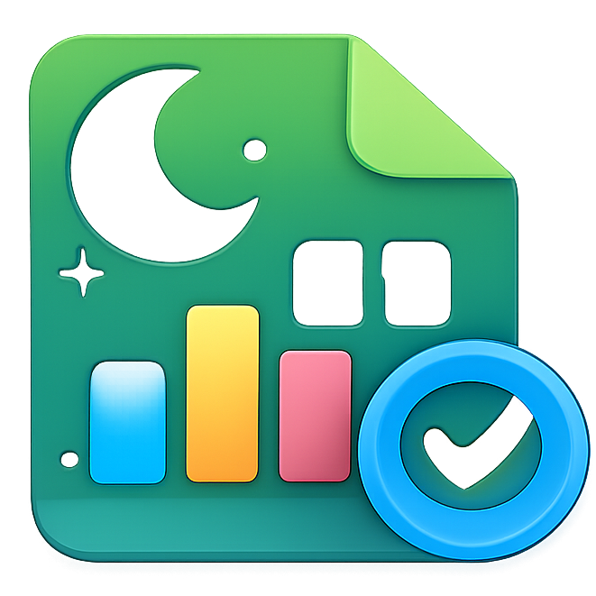

  
  <h1>Habit OS</h1>

A beautiful, premium, and personal Habit Tracker application that helps you organize your life, track your habits, and visualize your progress. 

Focused on privacy and simplicity, it uses **Google Sheets** as your personal database—meaning you own your data completely.

*(Note: Add a screenshot of your dashboard here)*

## ✨ Features

*   **Habit Tracking**: Create unlimited habits with custom colors and icons.
*   **Daily Logging**: Mark habits as complete/incomplete for any day.
*   **Sleep Tracker**: detailed sleep logging and trend visualization.
*   **Screen Time Tracker**: Monitor your digital wellness with daily logs and monthly charts.
*   **Journaling**: Write daily reflection notes.
*   **Analytics**: 
    *   Daily Progress Charts
    *   Monthly Grid Views
    *   Completion Rates & Best Day Stats
*   **Offline Capable**: Works offline with local mock data if the API is unreachable.
*   **Responsive Design**: Works on Desktop, Tablet, and Mobile.

## 🚀 Getting Started

Setting up your own instance is easy. Everything is split into two parts: the Backend (Google Sheets) and the Frontend (React App).

### Step 1: Backend Setup
First, send up your Google Sheet database.
👉 **[Read the Backend Setup Guide](./docs/BACKEND_SETUP.md)**

### Step 2: Frontend Setup
Next, run the application locally on your computer.
👉 **[Read the Frontend Setup Guide](./docs/FRONTEND_SETUP.md)**

## 🛠 Tech Stack

*   **Frontend**: React, Vite
*   **Styling**: Tailwind CSS
*   **Icons**: Lucide React
*   **Charts**: Recharts
*   **Date Handling**: Date-fns
*   **Backend**: Google Apps Script + Google Sheets

## 📂 Project Structure

*   `src/components`: UI components organized by feature (Habits, Sleep, ScreenTime, etc.)
*   `src/context`: React Context for state management
*   `src/services`: API connectors for Google Apps Script
*   `googleappscript.js`: The source code for the Google Apps Script backend

---
*Created by Yaduttam Pareek*
