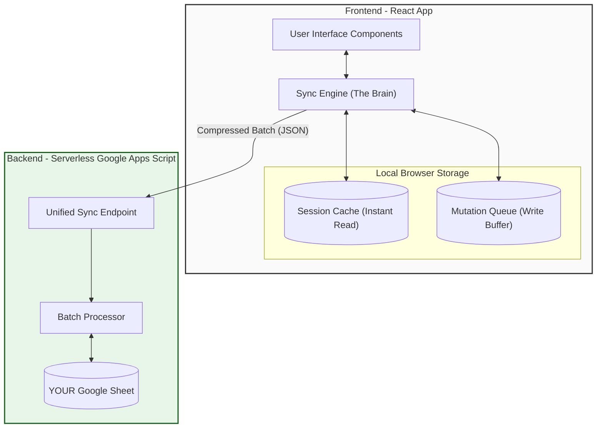
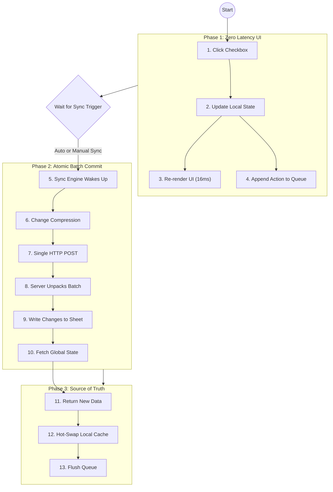

# ⚡️ Architecture & Data Flow

> **The Problem:** Most habit trackers hold your data hostage or require expensive monthly subscriptions for sync.  
> **The Solution:** A professional-grade, **Offline-First** React App that uses **Google Sheets** as a free, specialized, and private backend database.

This architecture delivers **60fps performance** on any device, zero latency interaction, and complete data ownership.

---

## 1. The "Secret Sauce" Architecture

We rely on a **Queue-Based Optimistic UI** pattern. This means the app never waits for the internet.

## 2. The Completel Data Lifecycle

Trace a single user action: **"Checking off a Habit"**.

## 3. Data Models (Private & Exportable)

Your data isn't hidden in a binary blob. It lives in readable rows in YOUR Google Sheet.

| Sheet Name | Columns | Description |
| :--- | :--- | :--- |
| **Habits** | `id`, `name`, `color`, `icon` | Configuration for your tracker. |
| **DailyLogs** | `date`, `completedHabits`, `sleep`, `journal`, `screenTime`, `moneySpent` | The heavy lifting. A JSON array stores completion IDs and expense details. |
| **Settings** | `key`, `value` | App preferences (Theme, Mode). |

## 4. Why Developers Love This

### 🚀 **Batch Processing (The 1-Request Rule)**
Instead of firing 10 requests when you mark 10 days as "Done", we fire **1 request**.
- **Efficiency**: 10x less battery usage.
- **Speed**: Syncs months of data in < 800ms.
- **Safety**: Atomic transactions (all or nothing).

### 🛡 **Privacy by Default**
We don't have a database. **You** have a database.
- The app is just a window into your personal Google Sheet.
- Zero tracking.
- Zero subscriptions.
- 100% Exportable (It's just a spreadsheet!).

### 🔁 **Conflict Resolution**
The "Server (Sheet)" is always the **Source of Truth**.
1. We push your changes.
2. We immediately download the Sheet's state.
3. If changes happened on another device, they overwrite your local cache instantly.
